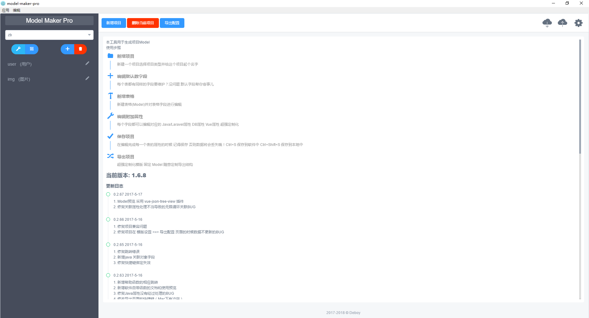
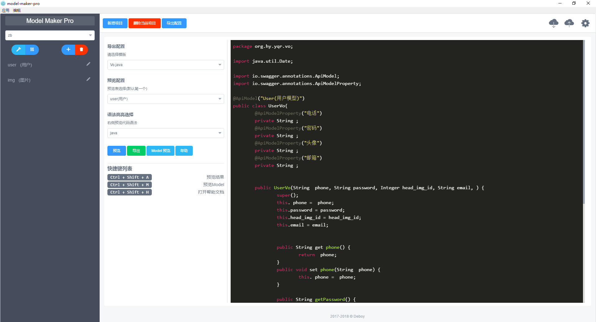

## 软件介绍
`ModelMakerPro` 一款以设计软件表结构为核心 通过与模版结合 生成各种文件的工具     
模版可以是`Java`项目的  
`Domain` `Repository` `Controller` `Service`    
也可以是`Laravel`项目的    
`routes` `Controller` `Model`
如果希望支持其他项目模版 可以参考 一个标准模版的[编写示范](https://github.com/deboyblog/model-maker-pro/blob/master/src/renderer/config/default-row/springboot.js)提交你们的模版 
等待你们发掘

## 开发技术栈: 
- [Vue.js](https://cn.vuejs.org/) 
- 以及了解 [electron](https://electron.atom.io/docs/) API 调用 就这么简单
- 使用到的UI库: [iview](https://www.iviewui.com/)

## 截图




## 如何新增 语言/框架 支持
1. `fork` 项目  
2. 下载到本地 到 `/src/renderer/config/default-row` 目录下拷贝一份非`index.js`的文件  
3. 重命名为你的框架的名字 后缀必须是.js 放到同级目录
4. 提交 然后 创建 `pull request`

## 模版编写规范(导出才用到的)
> 晚些放上 `demo`

模版引擎采用了 [`handlebars`](http://handlebarsjs.com/)   
我深知我个人是无法了解多种语言/框架的编写规范和所需要的重复劳动, 因此, 我需要你的帮助!  
你们对自己常用开发框架有足够多的时间去深入了解, 因此, 你比我更适合为你所熟悉的语言/框架编写一个规范的配置.    
请提交模版到 `template` 目录中
命名规范
```bash
└─ Offical [username]
    └─ Java [language]
        └─ SpringBoot [Framework Name or Native]
```
然后 `pull request`

### 模版帮助函数(helper)
> 在软件中也可以看到 并且是最新的

- [assemble](http://assemble.io/helpers)
- [Handlebars辅助函数集](https://github.com/NEYouFan/nei-toolkit/blob/master/doc/Handlebars%E8%BE%85%E5%8A%A9%E5%87%BD%E6%95%B0%E9%9B%86.md)

## Build Setup
``` bash
# clone this rep
git clone https://github.com/deboyblog/model-maker-pro.git

# install dependencies
npm install 
# 国内请注意 electron 的源基本都下载不了
# 参照这个替换国内源安装
# https://npm.taobao.org/mirrors
# http://blog.tomyail.com/install-electron-slow-in-china/

# serve with hot reload at localhost:9080
npm run dev

# build electron app for production
npm run build

# lint all JS/Vue component files in `app/src`
npm run lint

# run webpack in production
npm run pack
```

## 相关文档

- electron: [https://electron.atom.io/docs/](https://electron.atom.io/docs/)

- electron-vue: [https://github.com/SimulatedGREG/electron-vue](https://github.com/SimulatedGREG/electron-vue)

- vue.js: [https://cn.vuejs.org/](https://cn.vuejs.org/)

## Q&A
### Q: 这玩意有什么用?
A: 启动一个项目(带数据库) 如果是`java` 以 `SpringBoot` 框架为例   
你需要为每个表都编写一份 `Domain` `Repository` `Controller` `Service`   
几乎都是重复的工作 为何不将这些工作交给机器? 

### Q: 怎么用
A:  
1. 你可以根据操作系统不同直接下载我们为你打包好的软件 然后通过遵循文档来使用
2. `clone` 这个 `repository` 然后自己修改想要适应你们项目的部分 打包 内部使用
3.  如果你觉得这个功能(可以是某个字段应该是默认的或者某个配置应该是默认的)应该是普遍 或者你发现并解决了软件的BUG
可以通过提交 `pull request` 或者 `issue` 来参与我们软件的开发 让这款软件更加完美

### Q: 我的项目用XXX框架的能用吗?
A: 当然可以
如果希望支持其他项目模版 可以参考   
一个标准模版的[编写示范](https://github.com/deboyblog/model-maker-pro/blob/master/src/renderer/config/default-row/springboot.js)   
强烈欢迎你们提交不同框架的模版 这会让软件更加强大 你也可以维护原有的模版 增强原模版的扩展性

### Q: 为什么是 Pro 版?
A: 因为非 Pro 版 我和我司已经踩够坑了 
我司主要后端是`Java`(`SpringBoot`) 我个人后端更偏爱 `PHP`(`Laravel`) <del>其实我最爱`js` 哈哈</del>     
刚开始写这个项目是结合我司其他方案整合一整套`CMS`生成系统的   
后来我又改成了`Laravel`适用的方案(`ModelMakerForLaravel`)
但是我发现字段等配置可以独立出来成为配置 于是就 <del>合体</del> 合并成为Pro 版了  
经过我司同意(这个软件是我一人编写的), 我决定将其开源, 我希望它能在开源的环境下得到成长. 

### Q: 我能放心使用吗
A: 经过我司实践 已经生成了一个项目     
但是呢 软件目前为止(2017-6-17) 
还有以下工作等待我去完成
- [] 目录重新划分
- [] 配置抽离
- [] 完善使用文档

你们可以尝试使用, 如果可以的话, 请把你们遇到的问题和觉得不合理的交互提交到[issues](https://github.com/deboyblog/model-maker-pro/issues)中 
我会抽时间完善它    
毕竟是亲生的     

### Q: 需要付费吗?
A: 完全不需要
## License
[MIT](https://en.wikipedia.org/wiki/MIT_License)
